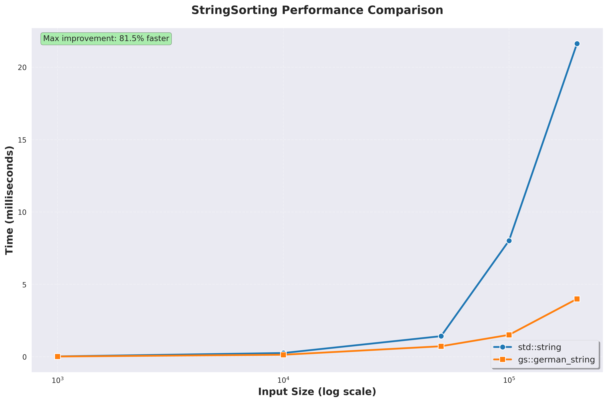

<style>
.centered-image {
  text-align: center;
}

/* Global code block styling */
pre {
  font-size: 0.8em; /* Adjust as needed: 0.7em, 0.75em, 0.9em */
}

code {
  font-size: 0.85em; /* For inline code */
}

/* Two column layout for images */
.two-columns {
  display: flex;
  justify-content: space-between;
  gap: 30px;
  align-items: center;
}

.two-columns > div {
  flex: 1;
  text-align: center;
}
</style>

# German strings

A case for yet another string type

<style scoped>
.author {
  position: absolute;
  bottom: 20px;
  left: 25px;
  font-size: 0.8em;
  opacity: 0.8;
  text-align: left;
}
</style>

<div class="author">
Dmytro Shynkar<br>
dmytroshynkar@gmail.com <br>
StockholmCpp 0x38
</div>

---

## Plan

- Intro and performance promises
- Implementation details
- Some use cases
- Name context

<!-- 
note: If you only want to know what this string type has to do with Germany you'll have to wait till the end ;)
-->

---

## We love strings...

... and we have some already!

* `<const> char*` - a C string, a NULL-terminated char array
* `std::basic_string<>` - owning mutable string, convertible to a C string, usually has SSO and takes up 32 bytes
* `std::basic_string_view<>` - a view into some string data, may not be null terminated
* Your favorite custom implementation

<!-- 
`<const> char*` - may be heap, may be stack, may be static, requires strlen to do anything with but takes up just 8 bytes
in this talk I talking strictly about modern consumer computers which are predominantly 64bits and little endian

-->

---

## We love strings...

### So why would we need any more?

<style scoped>
ul {
    font-size: 0.6em;
}
</style>

<div class="two-columns">
<div>


</div>
<div>



</div>
</div>

* 50-100% faster equality and comparison operations
* 2x smaller memory footprint for the string object

<!-- 
note: Based on totally trust-worthy benchmarks!
latest clang and libstdcxx
todo: maybe log scale for Y?
-->

--- 

## Anatomy of `std::string`
```
class string
{
    size_t size;
    size_t capacity;
    char* data;
};
```

<div class="centered-image">


</div>

--- 

## Anatomy of `std::string`

A bit closer to the truth

<style scoped>
.three-columns {
  display: flex;
  justify-content: space-between;
  gap: 30px;
  margin-top: 50px;
}

.column {
  flex: 1;
  text-align: left;
}
</style>

<div class="three-columns">
<div class="column">

```cpp
// gcc
struct string
{
    char* ptr;
    size_t size;
    union {
        size_t capacity;
        char buf[16];
    };
};
```

</div>
<div class="column">

```cpp
// msvc
struct string
{
    union {
        char* ptr;
        char buf[16];
    };
    size_t size;
    size_t capacity;
}
```

</div>
<div class="column">

```cpp
// clang
union string
{
    struct {
        size_t capacity;
        size_t size;
        char* ptr;
    } large;

    struct {
        unsigned char is_large:1;
        unsigned char size:7;
        char buf[sizeof(large) - 1];
    } small;
}
```

</div>
</div> 
<!-- 
note: Courtesy of raymond chen!
-->

---

## Anatomy of `std::string`

A common thing - SSO and a 32 byte size


<div class="centered-image">


</div>

Pictured here: `libstdc++`(GCC)

---

## Anatomy of `std::string`

- Always owning the memory
- Mutable
- Local for 15 to 23 byte-long strings
- Null-terminated

* `std::string_view` for non-owning strings
* Just a pointer and a size, 16 bytes

<!-- 
note: While all of the 3 big implementations make different tradeoffs while staying in the bound of std::string interface they share a lot in common
-->

---

## What's lacking?

If we are not bound by the standard and have a specific use case in mind, we can optimize for:

* Equality and ordering operations
* Avoiding copies where possible
* Fast small strings
* `std::string` *is usually good at the last one*

---

## What's lacking?

<style scoped>
ul {
    font-size: 0.5em;
}
</style>

Is it not optimal now?

<div class="centered-image">


</div>

* Obligatory Godbolt screenshot slide

<!-- 
note: We check the size but then basically get the data pointers and call memcmp. For the case of a non-small string it might be bad.
I'm very grateful for how simple Libstdc++ implementation is as the assembly of both msvc and libc++ is uch longer and more complex due to their SSO representations
-->

---

## What's lacking?

<div class="centered-image">


</div>

---

## What's lacking?

<style scoped>
ul {
    font-size: 0.5em;
}
</style>

Memory latency!

<div class="centered-image">


</div>

* Obligatory CPU cache and memory latency slide

---

## What's lacking?

What is an appropriate type here?

```cpp
std::vector<StringType> GlobalStringTable;

void addFromANetworkRequest(const NetworkRequest& request)
{
    GlobalStringTable.push_back(request.string());
}

void addFromAMmap(const MmapRegion& region)
{
    GlobalStringTable.push_back(region.string());
}

void addStatics()
{
    GlobalStringTable.push_back("static_string");
}
```

---

## What's lacking?

`std::string` is **large** - 32 bytes

<div class="centered-image">


</div>

* Suffers under the default calling conventions
* Takes up precious cache space

---


## What can we do differently?


* Always have a prefix locally
* *Sometimes* own the data

<br>

* Immutable
* 12-byte SSO
* 4 GBs size limit
* No null termination


<!-- 
note: We will go over each part now
-->

---

## What can we do differently?

<div class="centered-image">


</div>


---

## Sometimes owning the data - string classes

Why have separate `string` and `string_view` types at all?

By tagging the pointer with 2 bits of data we can assign each string to a *class*

- `temporary` - usual owning string
- `persistent` - always valid string
- `transient` - caller defined lifetime


---

## Sometimes owning the data - string classes

### Pros

- Avoids unnecessary copies
- Clear runtime values for lifetimes

### Cons

- A new footgun
- Relies on the canonical pointer form and unused bits

---

## Prefix

- Possibly avoid the cache miss on comparison
- Neatly becomes the prefix for the SSO string

<br>

* We need to touch the string memory when we are creating a view to it

---

## Show me the code!

```cpp
struct german_string
{
    std::uint32_t size;
    union {
        char small[12];
        struct {
            std::uint32_t prefix;
            char* data;
        } large;
    };
};
```

* Clean translation of the diagram
* **Does not work!**

<!-- 
note: Will take up 24 bytes, because the union will want to be aligned

-->

---

## Show me the code!

```cpp
struct german_string
{
    std::uint64_t state[2];
};
```

<div class="centered-image">


</div>

<!-- 
note: Rely on little endian
-->


---

## Show me the actual code!

Equality
```cpp
bool equals(const german_string& other) const
{
    if (_state[0] != other._state[0])
    {
        return false;
    }

    // If we are small, it's guaranteed that that the other one is as well 
    if (static_cast<std::uint32_t>(_state[0]) <= 12)
    {
        return _state[1] == other._state[1];
    }
    const char* my_ptr = reinterpret_cast<const char*>(_state[1] & ~PTR_TAG_MASK);
    const char* other_ptr = reinterpret_cast<const char*>(other._state[1] & ~PTR_TAG_MASK);
    return std::memcmp(my_ptr, other_ptr, _get_size()) == 0;
}
```

---

## Show me the actual code!

Compare
```cpp
int compare(const german_string& other) const
{
    const uint32_t min_size = std::min(_get_size(), other._get_size());
    const uint32_t min_or_prefix_size = std::min(min_size, sizeof(uint32_t));
    const int prefix_cmp = prefix_memcmp(_get_prefix(), other._get_prefix(), min_or_prefix_size);
    if (min_or_prefix_size == min_size || prefix_cmp != 0)
    {
        return prefix_cmp != 0 ? prefix_cmp : (_get_size() - other._get_size());
    }
    const int result = std::memcmp(
        _get_maybe_small_ptr() + 4, 
        other._get_maybe_small_ptr() + 4, 
        min_size - min_or_prefix_size
    );
    return result != 0 ? result : (_get_size() - other._get_size());
}
```

---

## Show me the actual code!

Bit magic!
```cpp
int prefix_memcmp(std::uint32_t a, std::uint32_t b, int n)
{
    std::uint32_t diff = a ^ b;
    std::uint32_t mask = (std::uint32_t)((0xFFFFFFFFull << (n * 8)) >> 32);
    diff &= mask;

    int first_diff = std::countr_zero(diff) / 8;
    std::uint8_t byte_a = ((std::uint64_t)a >> (first_diff * 8)) & 0xFF;
    std::uint8_t byte_b = ((std::uint64_t)b >> (first_diff * 8)) & 0xFF;
    return (int)byte_a - (int)byte_b;
}
```

* Around 2x faster than `std::memcmp`!

<!-- 
note: This is approximately 2x faster than std::memcmp for 4 byte values
branchless, may be counted as SWAR maybe?
-->

---

## Looking at benchmarks

<style scoped>
.two-columns {
  display: flex;
  justify-content: space-between;
  gap: 30px;
  align-items: left;
}

.two-columns > div {
  flex: 1;
  text-align: left;
}

.no-gap img {
  display: block !important;
  margin: 0 auto !important;
}

.no-gap p {
  margin: 0 !important;
  line-height: 0 !important;
}
</style>

<div class="two-columns">

<div>

- Clang + `libc++`
- GCC + `libstdc++`
- MSVC + `STL`

</div>

<div class="no-gap">


</div>

</div>

---

## Applications - 1BRC

<div class="centered-image">


</div>

<!-- 
2023 viral data aggregation challenge
note: Very fresh a definitely not biased. Aggregating a large volume of data from a CSV
-->

---

## Applications - 1BRC

The plan:

- Find a simple open source C++ implementation
- Replace all `std::string` with `gs::german_string`
- PROFIT!

* [Optimizing code to run 87x faster](https://simontoth.substack.com/p/daily-bite-of-c-optimizing-code-to) by Šimon Tóth


<!-- 
note: Maybe a demo
-->
---

## Applications - 1BRC

```cpp
struct Record { int cnt; float min, max, sum; }
std::unordered_map<StringType, Record> process_input(std::span<const char> data)
{
    std::unordered_map<StringType, Record> db;
    StringType station, value;
    while (getline(data, station, ';') && getline(data, value, '\n'))
    {
        float fp_value = stof(value);
        auto it = db.find(station);
        if (it == db.end())
        {
            db.emplace(station, Record{1, fp_value, fp_value, fp_value});
            continue;
        }
        update_record(it->second, fp_value);
    }
    return db;
}
```

---

## Applications - 1BRC

<div class="centered-image">


</div>

* 🎉🎉🎉
* But wait...

<!-- 
note: We basically took unoptimized version that did copy strings from the file to std::string
-->

---

## Applications - 1BRC

Applying the same thing to the optimized code

<div class="centered-image">


</div>

* We are ~10% slower...
* Hashing-heavy, small-key set
* A conditional on loading the data pointer hurts

<!-- 
note: Optimized version already used string_views and rarelly compared them, strings are city names and thereffore are mostly small
-->

---

## Applications - Toy LSM-tree KV-store

- Think HBase, LevelDB, RocksDB, etc. - but smaller and simpler
- Memory-mapped storage, single level of compaction

<div class="centered-image">


</div>

<!-- 
note: memory mapping is inadvisable
-->

---

## Applications - Toy LSM-tree KV-store

```cpp
template <typename StringType>
class LSMTree
{
    std::map<StringType, StringType> memtable_;
    std::vector<std::unique_ptr<SSTable<StringType>>> sstables_;
    std::string base_dir_;
    int next_sstable_id_;
};

template <typename StringType>
class SSTable
{
private:
    std::string filename_;
    mutable std::vector<std::pair<StringType, StringType>> data_cache_; // Cache for parsed data (sorted by key)
    mutable bool cache_loaded_;
    mutable std::unique_ptr<MappedFile> mapped_file_; // Persistent mapping
};
```

<!-- 
note: 
-->

---

## Applications - Toy LSM-tree KV-store

```cpp
std::optional<StringType> LSMTree::get(const StringType &key)
{
    auto result = memtable_.get(key); // std::map look-up
    if (result.has_value())
    {
        return result;
    }

    for (auto& sstable : std::views::reverse(sstables_))
    {
        result = sstable->get(key); // std::lower_bound
        if (result.has_value())
        {
            return result;
        }
    }
    return std::nullopt;
}
```
---

## Applications - Toy LSM-tree KV-store

<style scoped>
.no-gap img {
  display: block !important;
  margin: 0 auto !important;
}

.no-gap p {
  margin: 0 !important;
  line-height: 0 !important;
}
</style>

<div class="centered-image no-gap">


</div>

* A *lot* of string comparisons happen in both write and read paths
* We can avoid copying data in addition to `<=>` performance boost


<!-- 
note: 
-->

---

## Applications - Real World

<style scoped>
    .two-columns {
  display: flex;
  justify-content: space-between;
  gap: 30px;
  align-items: left;
}

.two-columns > div {
  flex: 1;
  text-align: left;
}
    </style>

<div class="two-columns">
<div>

Most high performance OLAP systems have them!

- DuckDB
- Apache Arrow & DataFusion
- Polars
- Velox

</div>
<div>


</div>
</div>

---

## Applications - Real World

<style scoped>
    .two-columns {
  display: flex;
  justify-content: space-between;
  gap: 30px;
  align-items: left;
}

.two-columns > div {
  flex: 1;
  text-align: left;
}
    </style>

<div class="two-columns">
<div>

DataFusion posts

- Faster parsing
- Significant improvement in E2E query performance

</div>
<div>


</div>
</div>

---

## Why German though?

<div class="centered-image">


</div>

<!-- 
note: Because of this guy
-->

---

## Sources and further info
If you want to learn more about German strings, check out these resources:
<style scoped>
ul {
    font-size: 0.6em;
}
</style>

- https://cedardb.com/blog/german_strings/
- https://cedardb.com/blog/strings_deep_dive/
- https://datafusion.apache.org/blog/2024/09/13/string-view-german-style-strings-part-1/
- https://datafusion.apache.org/blog/2024/09/13/string-view-german-style-strings-part-2/
- https://www.tunglevo.com/note/an-optimization-thats-impossible-in-rust/
- https://the-mikedavis.github.io/posts/german-string-optimizations-in-spellbook/
- https://15721.courses.cs.cmu.edu/spring2024/

https://github.com/dmitr101/german_strings

---

# Thank you for your attention

Questions?